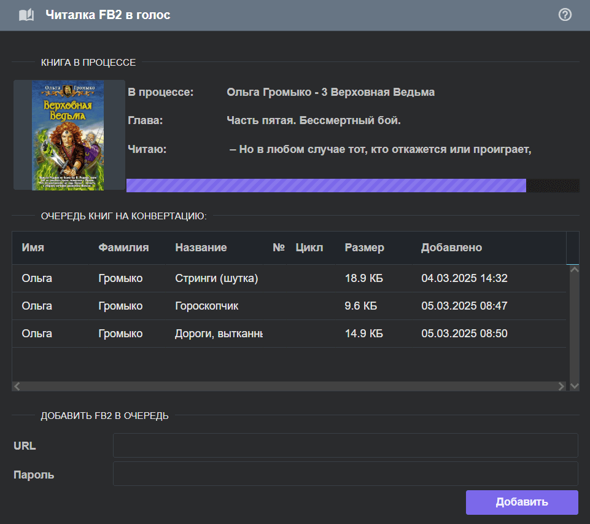

Говорилка FB2 в голос
=====================

Это программное обеспечение для чтения книг в аудио. На входе - обычная книга в формате FB2. На выходе - аудиокнига. Помните, вы сами несёте ответственность за легальность ваших книг!

В качестве движка для чтения используется [Silero](https://github.com/snakers4/silero-models). В данный момент поддержива.тся русский, украинский и английский языки.

