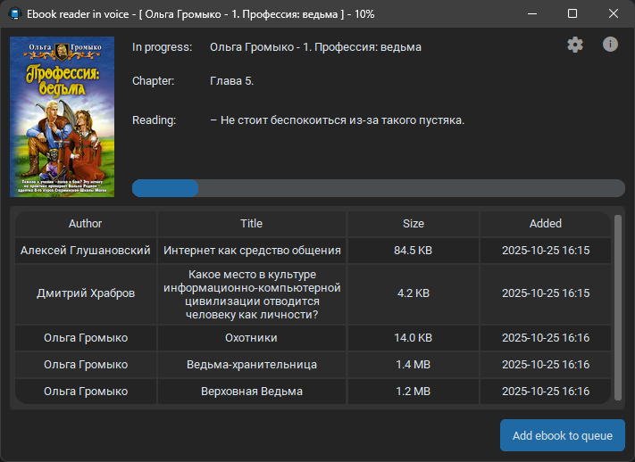

Ebook reader in voice
=====================

Converts textual books into audiobooks. The input is a normal book in Epub/FB2/TXT format. Output is a folder with a set of audio-files - audio book. Remember to feed the software with the books you properly own and have a license!

[Silero](https://github.com/snakers4/silero-models) is used as a TTS engine. List of the supported languages: English, Russian and Ukrainian.

Two UI modes is supported:

1. Web-version. It's mainly intented to run on servers, non-stop.
2. Desktop-version. For your local PC.


## Installation and using


### Desktop version

#### Windows

1. Download zip-archive from [Releases](https://github.com/DeXP/EbookTalker/releases/latest)
2. Unzip
3. Run the exe

#### Linux, Mac OS X etc

1. You have to have Python3 installed in your system.
2. `pip3 install -r requirements-desktop.txt`
3. `python3 desktop.py`


### WEB UI

### Docker (preferable)

Use docker-composite:

```
services:
  ebooktalker:
    image: dexperix/ebooktalker:latest
    container_name: ebooktalker
    restart: unless-stopped
    environment:
      FLASK_WEB_PASSWORD: "PASSWORD"
    volumes:
      - /your-output-folder:/ready
    ports:
      - 5000:5000
```

You can use `nocuda` tag instead of `latest` if you don't have Nvidia graphics card on your server. The version without CUDA runs on CPU and takes around ~10 times less disk space.


### Direct Python run

1. You have to have Python3 installed in your system.
2. `pip3 install -r requirements.txt`
3. `python3 -m flask run --host=0.0.0.0`

### Synology

You can install EbookTalker directly to Synology into Web Station. The process is described [here](https://medium.com/@rizqinur2010/deploying-python-flask-in-synology-dsm-7-without-docker-d99f1603bc87).


## Screenshots

Web UI:


Screenshot on Windows 11:




# Russian

Говорилка книг в голос
=====================

Это программное обеспечение для чтения книг в аудио. На входе - обычная книга в формате FB2/Epub/txt. На выходе - аудиокнига. Помните, вы сами несёте ответственность за легальность ваших книг!

В качестве движка для чтения используется [Silero](https://github.com/snakers4/silero-models). В данный момент поддерживаются русский, украинский и английский языки.

Поддерживаются два режима интерфейса:

1. Веб-версия. Предназначена для серверов, исполняется нон-стоп.
2. Настольная версия. Для локального компьютера.


## Установка


### Настольная версия

#### Windows

1. Скачать zip-архив из [Релизов](https://github.com/DeXP/EbookTalker/releases/latest)
2. Распаковать
3. Запустить исполняемый файл

#### Linux, Mac OS X и т.д.

1. Python3 должен быть установлен в системе.
2. `pip3 install -r requirements-desktop.txt`
3. `python3 desktop.py`


### WEB UI

### Docker (предпочтительно)

Используйте docker-composite:

```
services:
  ebooktalker:
    image: dexperix/ebooktalker:latest
    container_name: ebooktalker
    restart: unless-stopped
    environment:
      FLASK_WEB_PASSWORD: "PASSWORD"
    volumes:
      - /your-output-folder:/ready
    ports:
      - 5000:5000
```

Вместо `latest` можно использовать тэг `nocuda` - если на Вашем сервере нет видеокарты от Nvidia. Версия без CUDA занимает примерно в 10 раз меньше места на диске и исполняется только на процессоре.


### Прямой запуск через Python

1. Python3 должен быть установлен в системе.
2. `pip3 install -r requirements.txt`
3. `python3 -m flask run --host=0.0.0.0`

### Synology

Так же можно установить на Synology напрямую в Web Station. Процесс описан [здесь](https://medium.com/@rizqinur2010/deploying-python-flask-in-synology-dsm-7-without-docker-d99f1603bc87).
